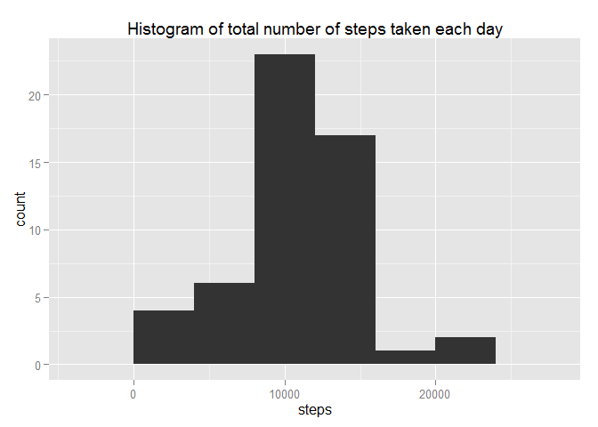
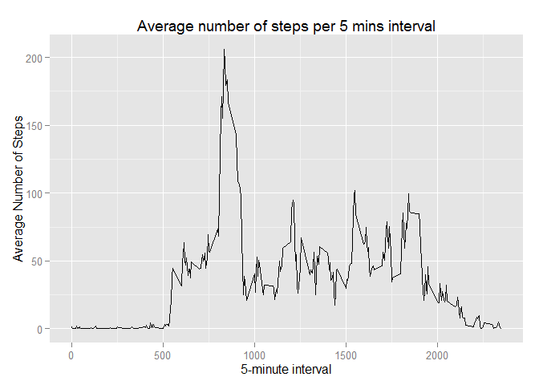
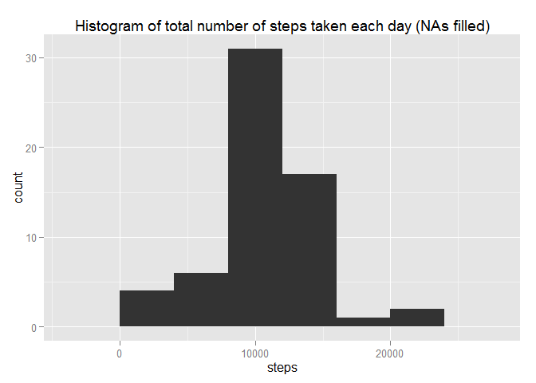
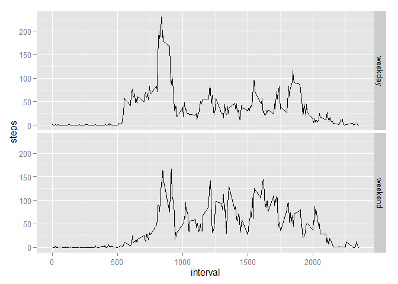
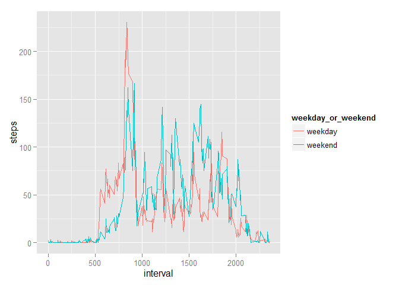

# Reproducible Research: Peer Assessment 1

The data in this assignment can be downloaded from the course web site:

* Dataset: [Activity monitor data](https://d396qusza40orc.cloudfront.net/repdata%2Fdata%2Factivity.zip)
  
The variables included in this dataset are:

* steps: Number of steps taking in a 5-minute interval (missing values are coded as  NA )

* date: The date on which the measurement was taken in YYYY-MM-DD format

* interval: Identifier for the 5-minute interval in which measurement was taken

The dataset is stored in a comma-separated-value (CSV) file and there are a total of 17,568 observations in this dataset.

## Loading and preprocessing the data


```r
unzip("activity.zip")
data <- read.csv("activity.csv")
```

## What is mean total number of steps taken per day?

Start by summing up the number of steps taken each day using the aggregate function. The NA values are removed.

```r
by_day <- aggregate(steps~date, data = data, sum, na.rm = TRUE)
```

Make a histogram of the total number of steps taken each day. ggplot2 is used here.

```r
library(ggplot2)
qplot(steps, data = by_day, 
      main = "Histogram of total number of steps taken each day", bin = 4000)
```

 

And here's to find the mean and median total number of steps taken per day

```r
total_steps_mean <- with(by_day, mean(steps))
total_steps_median <- with(by_day, median(steps))
print(total_steps_mean)
```

```
## [1] 10766.19
```

```r
print(total_steps_median)
```

```
## [1] 10765
```

## What is the average daily activity pattern?

A time series plot of the 5-minute interval is plotted on the x-axis.
The y-axis shows each interval's average number of steps over the measurement period.

```r
ave_step_by_interval <- aggregate(steps ~ interval, data = data, mean, 
                               na.rm = TRUE)
qplot(interval, steps, data = ave_step_by_interval, geom = "line", 
      ylab = "Average Number of Steps", xlab = "5-minute interval",
      main = "Average number of steps per 5 mins interval")
```

 

From the plot, the interval with the maximum average number of steps is around the 800 mins.
To find the exact interval:

```r
with(ave_step_by_interval, ave_step_by_interval[steps == max(steps), "interval"])
```

```
## [1] 835
```

## Imputing missing values
How many missing values are there in the dataset?

```r
sum(is.na(data$steps))
```

```
## [1] 2304
```

There are 2304 missing values in the dataset

For each interval, we assume that the missing values can take on the average number of steps for that interval. So We need to make sure there is a data point for the average number of steps for every interval.
Previously, we calculated the average number of steps per interval and stored it in an R object, ave_step_by_interval. By comparing the number of unique intervals in ave_step_by_interval, against the number of unique intervals in the original data set, we will be able to know whether all intervals have a value for the average number of steps. 

```r
length(unique(data[, "interval"]))
```

```
## [1] 288
```

```r
length(unique(ave_step_by_interval[, "interval"]))
```

```
## [1] 288
```

```r
length(unique(data[, "interval"])) == 
    length(unique(ave_step_by_interval[, "interval"]))
```

```
## [1] TRUE
```
Indeed, ave_step_by_interval has the same number of unique intervals as the original data.

Since all the intervals have a mean step value, we can fill in the missing values with the average number of steps. However, average number of steps is a double, while the number of steps itself is a whole number. So I have rounded the average number of steps to the nearest whole number, before filling into the missing values.
Code for filling in the missing values:

```r
# Create a copy of the data.frame first
data_filled = data

# Fill in the NAs by iterating through each row in the data.frame
for (i in 1:length(data_filled$steps)) {
    # When "steps"" has an NA found in that row
    if(is.na(data_filled[i,"steps"])) {        
        data_filled[i, "steps"] = as.integer(
            round(ave_step_by_interval[ave_step_by_interval$interval 
                                    == data_filled[i, "interval"], "steps"]))
    }
}

# Check that there are no NAs in data.filled
sum(is.na(data_filled$steps))
```

```
## [1] 0
```

All the NAs have been filled in because sum of the NA values in the steps column is 0.

To create a histogram of the total number of steps taken each day, the aggregate function is called once again. The historgram is then drawn.

```r
by_day_filled <- aggregate(steps~date, data = data_filled, sum)
qplot(steps, data = by_day_filled, bin = 4000,
      main = "Histogram of total number of steps taken each day (NAs filled)")
```

 

How did the mean and median differ from the estimates earlier?

```r
with(by_day_filled, mean(steps)) - total_steps_mean
```

```
## [1] -0.549335
```

```r
with(by_day_filled, median(steps)) - total_steps_median
```

```
## [1] -3
```
The earlier estimate is 0.549335 higher than the filled in means, while median is 3 steps more than the filled in median. 

For a clearer comparison,

```r
compare_df <- data.frame(na.fill.status = c(rep("filled", 2), rep("unfilled", 2)), 
                         measurement = rep(c("mean", "median"), 2), 
                         values = c(with(by_day_filled, mean(steps)), 
                                    with(by_day_filled, median(steps)),
                                    with(by_day, mean(steps)),
                                    with(by_day, median(steps))))

xtabs(values ~ na.fill.status + measurement, data = compare_df)
```

```
##               measurement
## na.fill.status     mean   median
##       filled   10765.64 10762.00
##       unfilled 10766.19 10765.00
```

## Are there differences in activity patterns between weekdays and weekends?
Finally, differences in weekdays and weekends activity is compared.

When dealing with dates, it is always a favourite of mine to use the lubridate package because the functions are more intuitive.


```r
str(data_filled$date)
```

```
##  Factor w/ 61 levels "2012-10-01","2012-10-02",..: 1 1 1 1 1 1 1 1 1 1 ...
```
"date" is a factor. Let's turn it into a date, and categorized it into weekend or weekday

```r
library(lubridate)
```

```
## Warning: package 'lubridate' was built under R version 3.1.3
```

```r
data_filled$date <- ymd(data_filled$date)
# wday() returns a value from 1 to 7, with Sunday being a 1.
# Therefore when wday() equals 7 or 1, it is a weekend.
weekday_or_weekend <- ifelse(wday(data_filled$date) %in% c(1, 7), "weekend", "weekday")

activity.pattern <- data.frame(data_filled, weekday_or_weekend)

# Averaging the steps according to the interval and weekday/weekend
average_steps <- aggregate(steps ~ weekday_or_weekend + interval, data = activity.pattern, 
                           mean)

# plot the graph
qplot(interval, steps, data = average_steps, facets = weekday_or_weekend~., 
      geom = "line")
```

 

Weekday activity peaks at 835 mins, with lower peaks after that. Weekend, on the other hand, though does not peak as high as during weekday, showed a more uniform period of activity from 800 mins to 2000 mins

My preferred plot to show the difference, is by overlaying both plots

```r
qplot(interval, steps, data = average_steps, color = weekday_or_weekend, 
      geom = "line")
```

 

It can be seen clearer that weekends may have more activity than weekdays.
